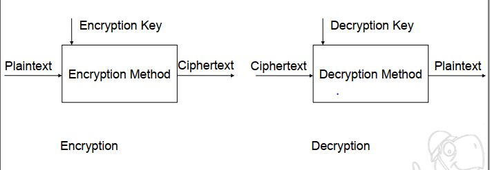
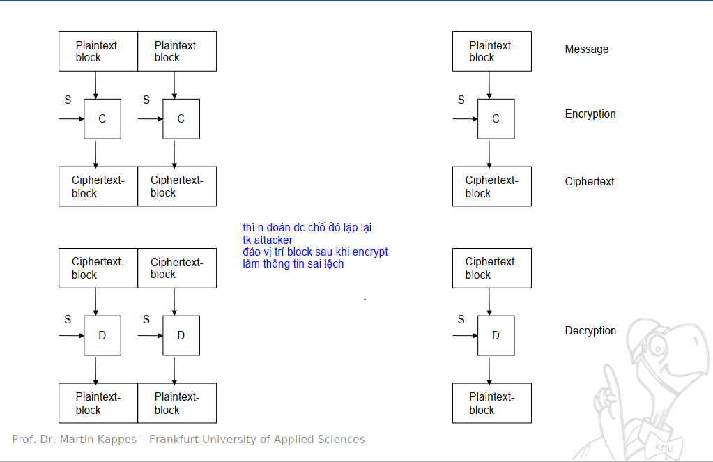
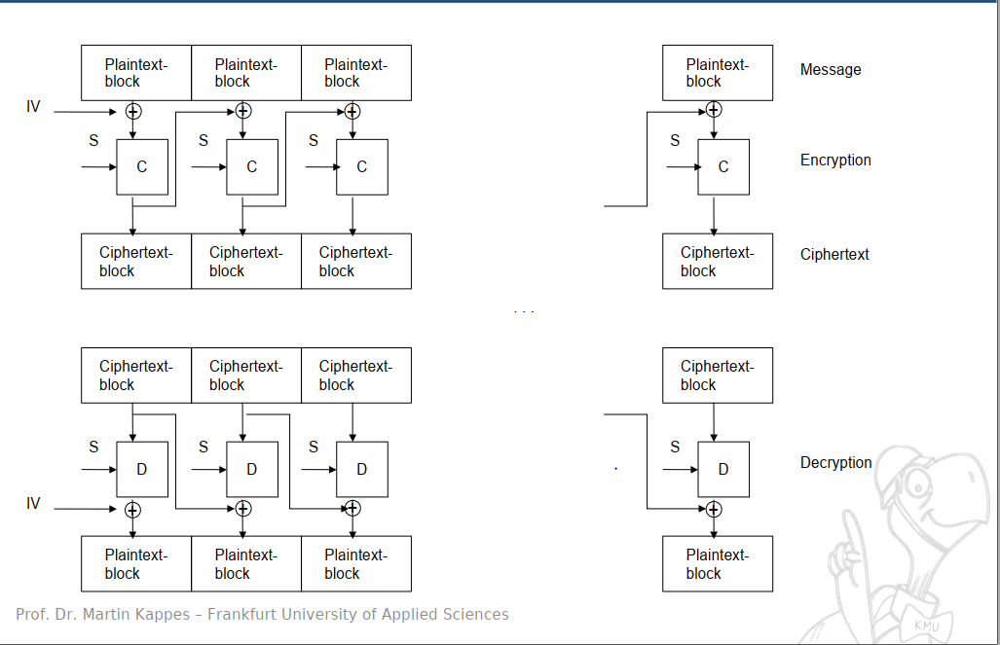
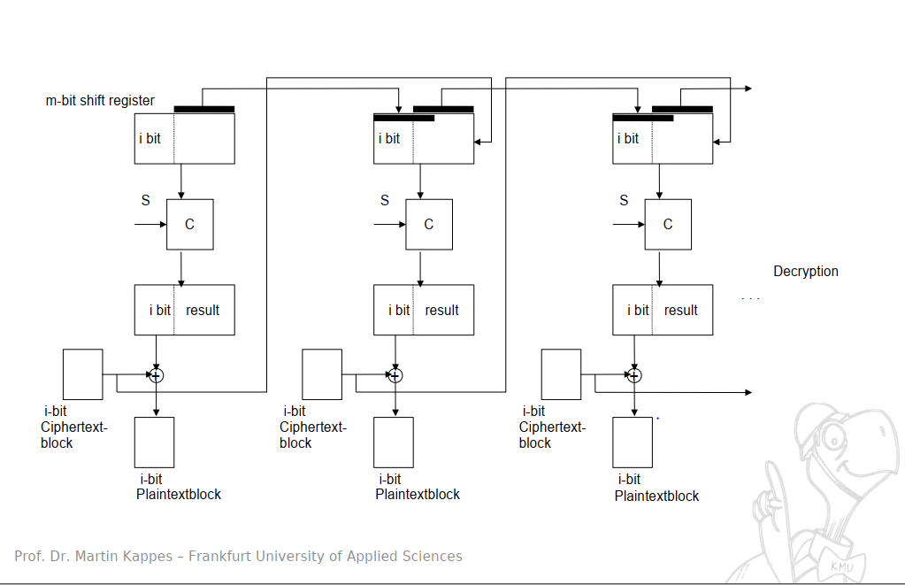
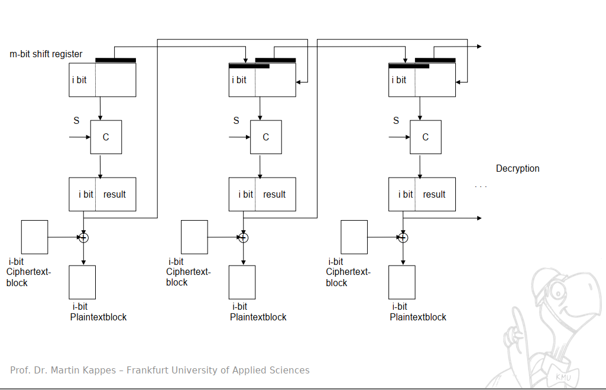
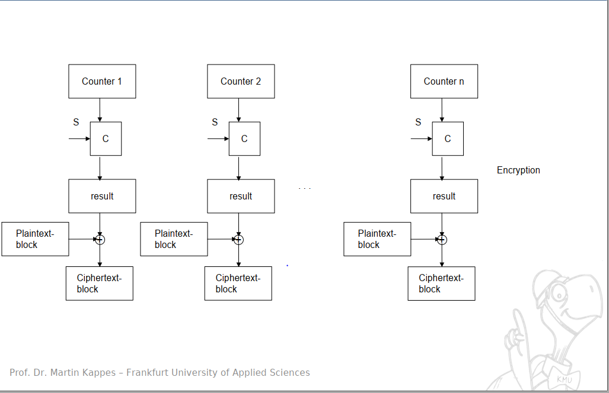
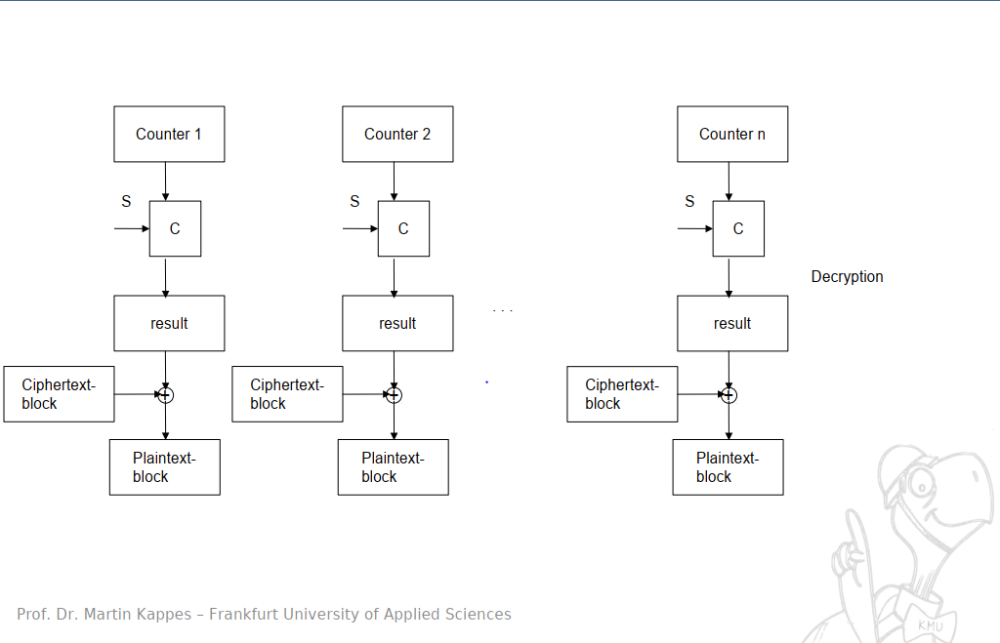
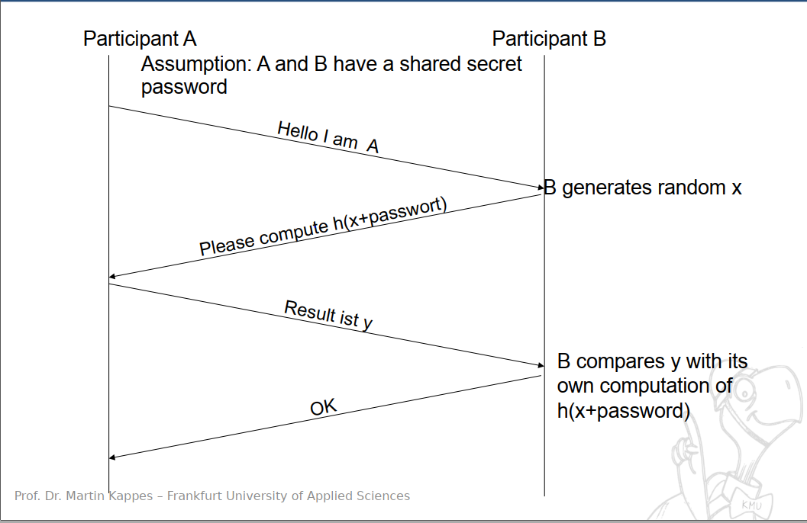
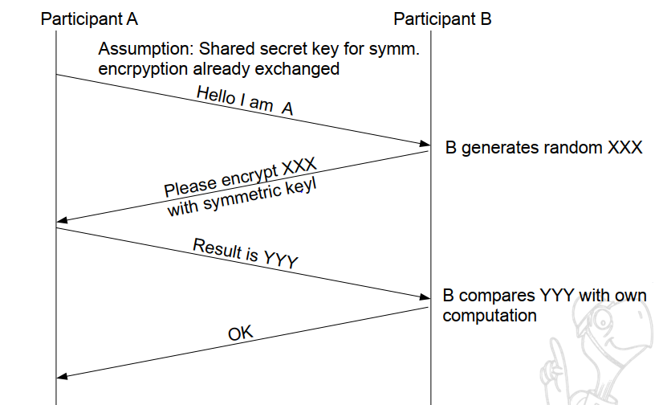
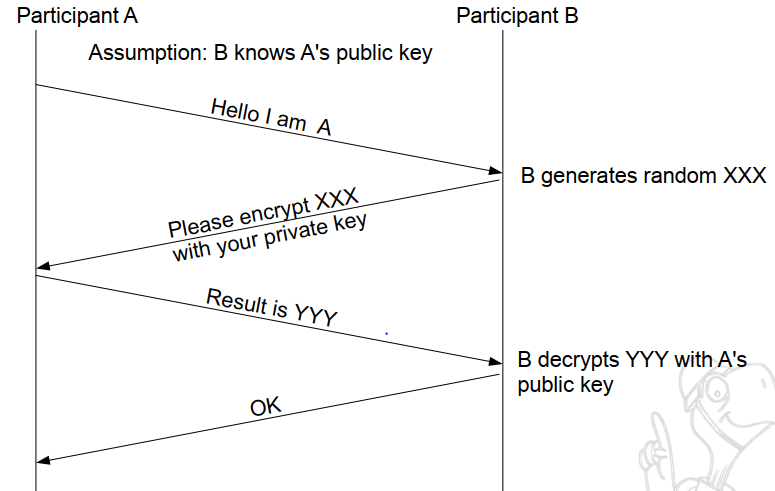

<h1> IT Security </h1>

*Here are the list of information that need to be composed* 

# Lec1
## Introduction

   * **What is the term of security?**
           * Protection of information and information systems against `unauthorized access` and `modification` and `availability` of information system services for `legitimate users`, including measures to thwart, discover or log threats. Protection against unauthorized access must be ensured during `storage`,` processing` or `in transit`
* **What is the aim of security? Example**
    * Confidentiality: Against unauthorized access
    * Integrity: Against unauthorized modification
    * Availability: Resources and services are available for legit users
    * Authenticity and authentication:  Explicit identification of the sender of info or a communication peer
* **What are passive and active attack?Why those need to be distinct**
     * Passive
          * Attacker doesn't actively participate
          * Difficult to discover
          * Preventive means of protection against active attacks (?)
     * Active
          * Attacker actively participate
          * Manipulate data or systems
          * Attacker often leaves traces
          * Prevention and Detection is possible
     * Why distinct these 2 type of attack? **not sure**
          * Because each of these attack focus on different basis, perform diff task, cause different type of damage and and focus on different IT-Security aim. => need to differentiate to have suitable method to prevent those attack
* **Explain security processes and its phases** (not sure)
     * Plan: Establish `objectives and processes` required to deliver the `desired results`.
     * Do: The do phase allows the `plan` from the previous step `to be done`. `Small changes` are usually `tested`, and data is gathered to see `how effective` the change is.
     * Check: During the check phase, the `data and results` gathered from the do phase are `evaluated`. Data are `compared to the expected outcomes` to see any  similarities and differences. The testing process is also evaluated to see `if there were any changes from the original` test created during the planning phase. To see `what changes work better` than others, and if said changes  can be `improved` as well.
     * Act: This act phase is where a `process is improved`.  Records from the "do" and "check" phases help `identify issues` with the  process. These issues may include problems, non-conformities,  opportunities for improvement, inefficiencies and other issues that result in outcomes that are evidently less-than-optimal. Root `causes of  such issues are investigated`, `found and eliminated` by modifying the  process. Risk is `re-evaluated`. At the end of the actions in this phase,  the `process has better instructions, standards or goals`. `Planning for  the next cycle` can proceed with a `better base-line`. Work in the `next do phase` should `not create recurrence` of the identified issues; if it does, then the action was not effective.
* **Difference between nonrepudiation and authenticity**
  * Authentication verifies who you are (User-ID) while Non-Repudiation verifies what you did (e.g Sending a message).
  * Authenticity is about one party (say, Alice) interacting with another (Bob) to convince Bob that some data really comes from Alice.
  * Non-repudiation is about Alice showing to Bob a proof that some data really comes from Alice, such that not only Bob is convinced, but Bob also gets the assurance that he could show the same proof to Charlie, and Charlie would be convinced, too, even if Charlie does not trust Bob.

# Lec2
## Cryptography

   * **Model of a cryptographic system**
         * slide
      * 
* **Classical encryption methods?**
   * Substitution
   * Transposition
   * Product cipher
   * Applying multiple substitutions and/or transpositions possible  
* **Differences between public key and symmetric encryption schemes and their respective adv and disadvantage**
   * Symmetric encryption schemes: key is identical for both sender and receiver 
      * Advantage: 
        * Faster
        * Because the key is not transmitted with the data, so if the connection is intercepted, the data is safe
        * Only the system which possesses the secret key can decrypt a message
      * Disadvantage:
        * The secret key must be exchange before the message, and if the attacker can intercept the connection, then any message using that key to encrypt can be decrypted
        * Cannot provide digital signatures that cannot be repudiate
   * Public key: different pair of key for every direction of communication
      * Advantage:
        * There is no need to exchange the private key (which help the recipient to read the encrypted message) so if the connection is intercepted, the message is still safe
        * Can provide digital signatures that can be repudiated
      * Disadvantage:
        * Slower
* **Term of Hybrid encryption scheme and its sequence thereof**
   
   * It's like the mix of symmetric and public key schemes: say sender S want to send R a message, S will send R a public key, then R will use that key to create a session key, then R will use S's sent public key to encrypt another key and send back to S to join the created session key. And in that session, symmetric encryption is used **not sure**
* **Term of "Mode of operation". Outline encrypt and decrypt for at least 2 different modes**
   * Mode of operation is  an algorithm used in conjunction with a block cipher that makes up the complete encryption algorithm
   * Used in CBC, CFM
* **Conditions must be met to conduct brute force attack**
  
  * Length of cipher must longer than key and key must be finite number of bit
* **What is One time pad? and why it is unbreakable if the encryption key is unknow**
  
  * Use randomness to generate key, and encrypt the message with that random key, so it is uniform distribution
* **How Electronic Code Book (ECB) work. Its adv and disadvantage? When this method can be use **
   * How it works: The user take the first block of plaintext and encrypts it with the key to produce the first block of ciphertext. Then takes the the second block and do the same process and so on
   * 
   * Advantage: Simple to implement, and can be processed in parallel.
   * Disadvantage: Blocks of plaintext go through the same encrypt processes, so the attacker might guess the plaintext if 1 plaintext is sent over and over again. The attacker can also mess up the block order => make the message incorrect
* **How Cipher Block Chaining,Cipher Feedback Mode, Output Feedback Mode, Counter Mode work? **
   * CBC: 
   
   * CFB:
   
     
   
   * OFB:
   
     
   
   * CM
   
   * 

# Lec3
## Authentication

* **Term of "Authentication" and "Authencity". Factors for it? What is two-factor-authentication**
    	* Authencity: The quality of being genuine or not corrupted from the original. 
    * Authentication: something which validates or confirms the authenticity of something 
    * What you know (Password), What you have (Token), What you are (Biometry)
    * 2-Factor-authentication: provide multiple proof of your identification to get the permission to access.
* **Name and explain on which points the security of password-based authentication schemes depends.**

     * Size of password domain, choice of password and password policies
     * Security of strong passwords
     * Security when entering/transmitting passwords.
* **How secure password should be chosen?(Not sure)**
* Long password, special character, capital letter, numbers, don't use natural language
* **Describe the sequence in a password-based challenge-response authentication and compare its security with sending the password directly either encrypted or unencrypted.**
* Sequence:
     * Compare: 
* **Describe the terms Token, Smart Card and Biometry and explain their use for authentication**
* Token: a device that show digits that are changed every minute, can be calculated on the token with some cryptographic embedded in the token which is not ez to extracted
     * Smart card: card that is auth by prove themselves to the card reader that they are really presented by means of cryptography
     * Biometry: physical properties of a person. To prove that you are really you.
* **Describe Cryptographic Hash Functions**
  
  * Compute characteristic pattern (“fingerprint”) of fixed length for each message. Mostly 128 or 256 bits. It should be impossible to find a message producing a given hash value, to find two messages with the same hash value. Widely used algorithms: MD5 and SHA
* **Describe how public key or symmetric cryptography can be used for authentication.**

     * Symmetric key: 
     * 
     * Public key: 
* **Describe what a digital signature is and how it operates. Also describe how hash functions are used in digital signatures.**

     * A process that guarantees that the contents of a message haven't been altered in transit. Sender signs message with private key. Public key is used for validation
     * Hash function: transforming data of any size into a fixed size. Hash function will  generate unique digital fingerprint. Alice writes a message to Bob, A will hash the message, and then combines the hash value with her private key to generate a digital signature.
* **Explain in detail format, composition and use of certificates. Also describe Certificate Authorities, Root-CA and Certificate revocation.**

     * Format: Bundle of Information of the owner of public key, along with public key, signature of certificate authority (also info about CA).
     * Certificate authority: take the certificate request which consist of  info of the entity (user, web server, ...) along with it's public key, and then it check that this public key is truly belong to that entity. Then CA will sign this certificate with it's private key (compute the hash, then encrypt the hash with private key)
     * Certificate: say B, might not know A but B know its CA and B already had the public key of that CA, so B can check that whether the signature is ok or not. So if B trust this CA, then B can know the public key of A.
     * Root-CA: CA sign its own certificate
     * Certificate revocation: certificate that is no longer valid because that have been withdrawn
* **Discuss advantages and disadvantages of using cerfiticates and CAs.**
* Advantage: Certificate is public, so anyone can have.
     * Disadvantage: 
       * Trustworthy only given if the root CA and other CA involved in the process are trustworthy
       * CA is compromised and still issuing certificate which might not belong to valid institution
       * Revocation is problematic because sometime this is not checked.

# Lec4
## Operating System Security (this lesson exercise file hasn't covered all the topic in the lecture)

   * **Main tasks of an Operating System and how do they relate to security**
        * Hides complicated details from users and, applications which otherwise had to be dealt with, Provides „Virtual Machine“ which is much easier to use, Allocates resources to different users, processes
* **Explain how the access control mechanisms implemented by an Operating System can be circumventde by an attacker and in which cases it can be enforced**
  * Use admin privilege to access to other individual's information in the organization
* **Explain Linux's access control mechanism in detail**
  * Each file has permission specified for 3 specific type of user (see below)
* **Explain each of the field in ls-l command's return**
  * drwxr-xr-x 2 max staff 4096 Mar 27 12:15 test 

  * d-: file type: directory (l for link)
  * first 3: permission for the owner
  * 3 after: for the group which the file belong to
  * 3 after: for everyone
  * number of link of directories inside this directory
  * user name
  * group name
* **Which permissions are sufficient to execute a file containing a binary? Which permissions are sufficient to execute a shell script?**
  * x
* **Which permissions are needed to copy a file?**
  * source: r, target: w x
* **Which permissions are necessary to move a file?**
  * source: w, target: w x
* **`setfacl` `geftacl` do and explain their practical use in a self-chosen example. What chances do the use of ACLs imply for the commands ls, cp and mv?**
  * `setfacl`: set ACL of files and directory  (ex: Gán quyền đọc , ghi, thi hành cho user bao và group friend: `setfacl -m user:bao:rwx,group:friends:rwx mydir` )
  * `getfacl`: see information of the ACL of the file

# Lec5
## Applications (this lecture dont have exercise)
   * **Buffer overflow?**
* **Race conditions?**
* **Active content?**

​    
# Lec8
## Network security

   * **Depict potential threats when communicating over a network.**
* **Explain why an attacker might manipulate routing in a network**
* **Explain the following attacks:**
     * **MAC Address Spoofing**
     * **ARP Spoofing**
     * **IP Spoofing**
     * **TCP Sequence Number Attack**
     * **Phishing**
     * **Pharming / DNS Spoofing**
* **Advantages and disadvantages of security mechanisms and protocols on all layers of the network reference model and compare them. Also, give examples for their use.**

# Lec9
## Firewalls

   * **Firewalls ? Packet filter ? application level gateway ?demilitarized zone? tunnel**
* **How packet filter works**
* **Network Address Translation is and how it works.**
* **inherent weaknesses and vulnerabilities in the concept Firewalls**
* **Describe how a static packet filter distinguishes between incoming and outgoing TCP connections. Denote the corresponding rules in pseudo notation or verbally.**
* **Describe how a dynamic packet filter distinguishes between incoming and outgoing TCP-connections. Denote the corresponding rules in pseudo notation or verbally.**

# Lec10
## Virtual Private Networks

   * **VPN? RAS? Site-to-site VPN?**
   * **How IPSec works in detail. In your explanation, the terms AH, ESP, Tunnel Mode and Transport mode should be addressed. Also, describe what the Sequence Number in AH and ESP is used for.**

        * **Explain and describe how OpenVPN works in detail. In your explanation, the terms tun device and tap-device should be addressed.**

## Lec13

# Network Applications (this lecture dont have file exercise)

* **POP-Auth?**
* **How emails work?**
* **App layer encryption**
* **SSH**
* **Local PFW**
* **Remote PFW**
* **TLS/SSL**
* **Dynamic content**
* **Simple Anonymization**

